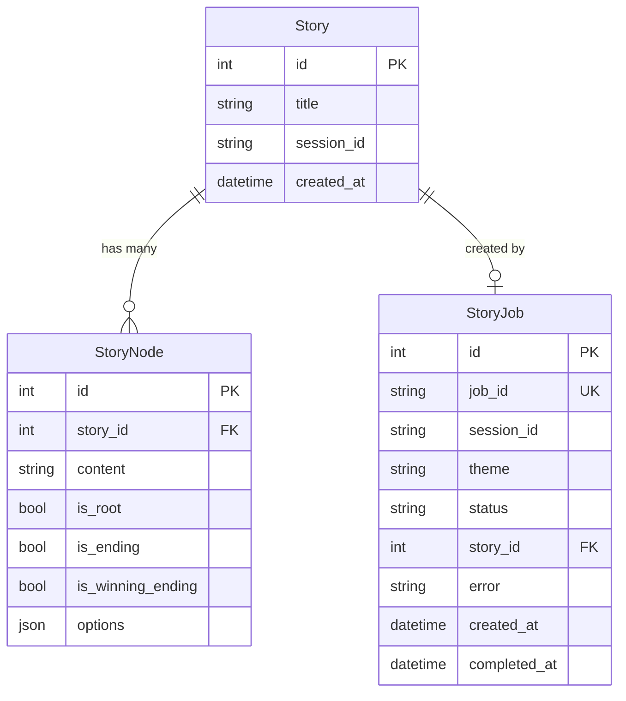

<p align="center">
  <h1 align="center"> The Adventure</h1>
  <p align="center"><strong>AI-Powered Choose-Your-Own-Adventure Story Game</strong></p>
  <p align="center">
    Generate unique, branching interactive stories on any theme — powered by GPT-4o-mini.
  </p>
</p>

---

## Overview

**The Adventure** is a full-stack web application that uses AI to generate and play interactive, branching "choose-your-own-adventure" stories. Users enter a theme (e.g. *pirates*, *space*, *medieval*), and the app generates a complete story tree with multiple paths, choices, and endings — including both winning and losing outcomes.

Each story is a deeply nested decision tree where every choice leads to a different narrative branch, making each playthrough a unique journey.

---

## How It Works

1. **Choose a Theme** — Enter any theme or scenario you can imagine.
2. **AI Generates the Story** — The backend uses OpenAI's GPT-4o-mini via LangChain to generate a full branching narrative with 3–4 levels of depth.
3. **Play the Adventure** — Navigate through the story by choosing from 2–3 options at each decision point.
4. **Reach an Ending** — Some paths lead to victory, others to defeat. Restart or generate a brand new story anytime.

---

## Architecture

The application follows a decoupled monorepo architecture with a **FastAPI** backend and a **React** frontend.

```
The-Adventure/
├── backend/          # FastAPI REST API + AI story generation
│   ├── core/         # Config, prompts, LLM models & story generator
│   ├── db/           # SQLAlchemy database setup
│   ├── models/       # ORM models (Story, StoryNode, StoryJob)
│   ├── routers/      # API route handlers
│   ├── schemas/      # Pydantic request/response schemas
│   └── main.py       # Application entry point
│
├── frontend/         # React SPA (Vite)
│   ├── src/
│   │   ├── components/
│   │   │   ├── ThemeInput.jsx        # Theme selection form
│   │   │   ├── StoryGenerator.jsx    # Orchestrates generation + polling
│   │   │   ├── LoadingStatus.jsx     # Loading spinner during generation
│   │   │   ├── StoryLoader.jsx       # Fetches & loads a story by ID
│   │   │   └── StoryGame.jsx         # Interactive story player
│   │   ├── App.jsx                   # Root component with routing
│   │   └── util.js                   # API base URL config
│   └── index.html
│
└── README.md
```

---

## Tech Stack

| Layer       | Technology                                                                 |
| ----------- | -------------------------------------------------------------------------- |
| **Frontend** | React 19, Vite 7, React Router 7, Axios                                  |
| **Backend**  | FastAPI, Uvicorn, Python 3.11+                                            |
| **AI/LLM**   | LangChain, LangChain-OpenAI (GPT-4o-mini)                                |
| **Database** | SQLAlchemy ORM — SQLite (dev) / PostgreSQL (prod)                         |
| **Deployment** | [Choreo](https://wso2.com/choreo/) (PaaS)                              |

---

## API Endpoints

All endpoints are prefixed with `/api`.

### Stories

| Method | Endpoint                      | Description                                   |
| ------ | ----------------------------- | --------------------------------------------- |
| `POST` | `/api/stories/create`         | Submit a story generation job for a given theme |
| `GET`  | `/api/stories/{story_id}/complete` | Retrieve the full story tree by story ID   |

### Jobs

| Method | Endpoint              | Description                          |
| ------ | --------------------- | ------------------------------------ |
| `GET`  | `/api/jobs/{job_id}`  | Check the status of a generation job |

#### Job Statuses

| Status       | Meaning                                  |
| ------------ | ---------------------------------------- |
| `pending`    | Job created, waiting to be processed     |
| `processing` | AI is actively generating the story      |
| `completed`  | Story generation finished successfully   |
| `failed`     | An error occurred during generation      |

---

## Data Model

Stories are stored as a tree of nodes, enabling the branching narrative structure:



Each `StoryNode.options` is a JSON array of `{ text, node_id }` objects, forming a tree traversal structure.

---

## Getting Started

### Prerequisites

- **Python 3.11+** and `pip` (or [`uv`](https://docs.astral.sh/uv/))
- **Node.js 18+** and `npm`
- An **OpenAI API key**

### 1. Clone the Repository

```bash
git clone https://github.com/<your-username>/The-Adventure.git
cd The-Adventure
```

### 2. Backend Setup

```bash
cd backend

# Create and activate a virtual environment
python -m venv .venv
# Windows
.venv\Scripts\activate
# macOS/Linux
source .venv/bin/activate

# Install dependencies
pip install -r requirements.txt
```

Create a `.env` file in the `backend/` directory:

```env
DATABASE_URL=sqlite:///./database.db
API_PREFIX=/api
DEBUG=True
ALLOWED_ORIGINS=http://localhost:3000,http://localhost:5173
OPENAI_API_KEY=sk-your-openai-api-key-here
```

Start the backend server:

```bash
uvicorn main:app --host 0.0.0.0 --port 8000 --reload
```

The API docs will be available at:
- **Swagger UI:** [http://localhost:8000/docs](http://localhost:8000/docs)
- **ReDoc:** [http://localhost:8000/redoc](http://localhost:8000/redoc)

### 3. Frontend Setup

```bash
cd frontend

# Install dependencies
npm install
```

Create a `.env` file in the `frontend/` directory:

```env
VITE_DEBUG=true
```

Start the development server:

```bash
npm run dev
```

The app will be available at [http://localhost:5173](http://localhost:5173). In debug mode, Vite automatically proxies `/api` requests to the backend at `http://localhost:8000`.

---

## Configuration

### Environment Variables — Backend

| Variable        | Description                          | Default                    |
| --------------- | ------------------------------------ | -------------------------- |
| `DATABASE_URL`  | Database connection string           | `sqlite:///./database.db`  |
| `API_PREFIX`    | API route prefix                     | `/api`                     |
| `DEBUG`         | Debug mode (uses SQLite when `True`) | `False`                    |
| `ALLOWED_ORIGINS` | Comma-separated CORS origins       | `""`                       |
| `OPENAI_API_KEY` | Your OpenAI API key                 | *required*                 |

### Environment Variables — Frontend

| Variable      | Description                               | Default |
| ------------- | ----------------------------------------- | ------- |
| `VITE_DEBUG`  | Enables Vite's `/api` proxy to localhost  | `false` |

### Production Database

When `DEBUG=False`, the backend constructs a PostgreSQL connection URL from these environment variables:

| Variable      | Description              |
| ------------- | -------------------------|
| `DB_USER`     | PostgreSQL username      |
| `DB_PASSWORD` | PostgreSQL password      |
| `DB_HOST`     | Database host address    |
| `DB_PORT`     | Database port            |
| `DB_NAME`     | Database name            |

---

## Key Design Decisions

- **Async Job-Based Generation** — Story generation is offloaded to a background task. The frontend polls for job completion, keeping the UI responsive and avoiding HTTP timeouts during LLM calls.
- **Tree Data Structure** — Stories are stored as flat `StoryNode` records linked via a JSON `options` field, enabling efficient database storage while preserving the tree traversal experience.
- **Structured LLM Output** — LangChain's `PydanticOutputParser` enforces a strict JSON schema on GPT-4o-mini's output, ensuring reliable parsing of the branching story structure.
- **Session-Based Identity** — Users are identified via session cookies (no authentication required), making the experience frictionless.

---

## Deployment

The project includes a [Choreo](https://wso2.com/choreo/) configuration (`.choreo/component.yaml`) for cloud deployment. The backend is exposed as a REST API on port `8000` with public and project-level network visibility, and connects to OpenAI via a managed connection reference.

---

## License

This project is provided as-is for educational and personal use.

---

<p align="center">
  <em>Built using FastAPI & React</em>
</p>
